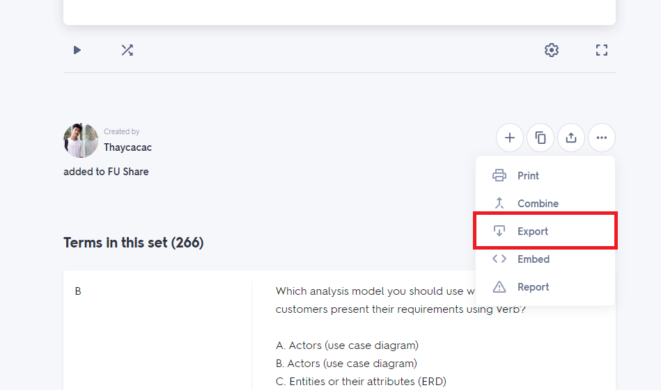
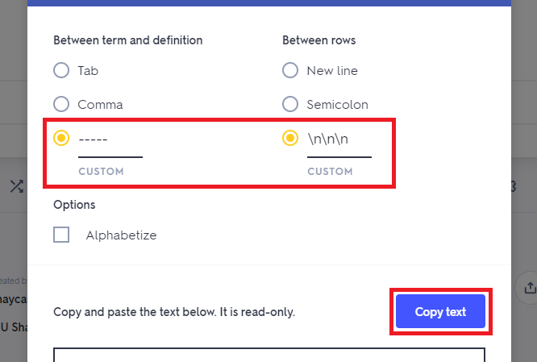

# Tutorial

## Export course from Quizlet

- Step 1: Visit to course you want to learn.

- Step 2: Click on "Export" button.

  

- Step 3: Setup `Between term and definition` is "-----" and `Between rows` is "\n\n\n", Click button "Copy text".

  

- Step 4: Paste text from clipboard to textarea.

- Step 5: Click "Create" button and enjoy learning.